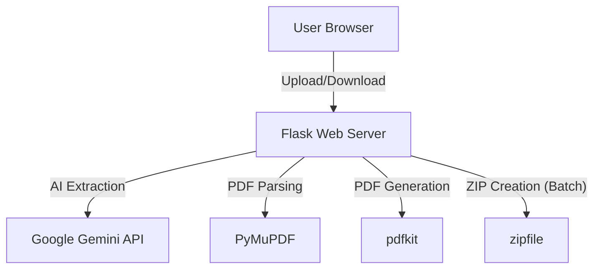

# Resume Formatter

## Table of Contents

1. [Project Overview](#project-overview)
2. [SDLC Phases](#sdlc-phases)
   - 2.1 [Requirements Analysis](#requirements-analysis)
   - 2.2 [System Design](#system-design)
   - 2.3 [Implementation](#implementation)
   - 2.4 [Testing](#testing)
   - 2.5 [Deployment](#deployment)
   - 2.6 [Maintenance & Future Work](#maintenance--future-work)
3. [Architecture & Technology Stack](#architecture--technology-stack)
4. [Features](#features)
5. [Installation & Setup](#installation--setup)
6. [Usage Guide](#usage-guide)
7. [API & Code Structure](#api--code-structure)
8. [DOCX Template Support](#docx-template-support)
9. [Security Considerations](#security-considerations)
10. [Troubleshooting & FAQ](#troubleshooting--faq)
11. [Contributing](#contributing)
12. [License](#license)

---

## 1. Project Overview

**Resume Formatter** is a web-based application that allows users to upload one or more PDF resumes and receive professionally formatted, single-page resumes in return. The system uses AI to extract and structure resume data, then generates a clean, modern PDF or a ZIP archive for batch processing.

---

## 2. SDLC Phases

### 2.1 Requirements Analysis

- **Functional Requirements:**
  - Upload single or multiple PDF resumes.
  - Extract structured data using AI.
  - Generate a formatted, single-page PDF for each resume.
  - Batch processing: Download all formatted resumes as a ZIP.
  - User-friendly, modern UI.
  - Error handling and progress feedback.

- **Non-Functional Requirements:**
  - Secure file handling.
  - Fast processing for both single and batch uploads.
  - Scalable for future enhancements (e.g., DOCX support).

### 2.2 System Design

- **Frontend:** HTML5, CSS3 (Bootstrap), JavaScript (AJAX for upload/download).
- **Backend:** Python (Flask), PyMuPDF for PDF parsing, pdfkit for PDF generation, Google Gemini API for AI extraction.
- **File Storage:** Temporary local storage for uploads and generated files.
- **Output:** PDF (single) or ZIP (batch).

**High-Level Architecture:**


### 2.3 Implementation

- **Frontend:** Responsive form, drag-and-drop, AJAX upload, spinner/progress, download trigger.
- **Backend:** Flask routes for upload, batch handling, AI integration, PDF/ZIP response.
- **Error Handling:** User feedback for invalid files, API errors, and processing failures.

### 2.4 Testing

- **Unit Testing:** For PDF extraction, AI response cleaning, and PDF generation.
- **Integration Testing:** End-to-end tests for single and batch uploads.
- **Manual Testing:** UI/UX, error scenarios, large batch uploads.

### 2.5 Deployment

- **Local:** Python virtual environment, Flask dev server.
- **Production:** Can be deployed on any WSGI-compatible server (e.g., Gunicorn, uWSGI) behind Nginx/Apache.
- **Cloud:** Suitable for deployment on AWS, Azure, GCP, or Heroku.

### 2.6 Maintenance & Future Work

- Add support for DOCX and image-based resumes.
- User authentication and dashboard.
- Resume template customization.
- Analytics and usage reporting.

---

## 3. Architecture & Technology Stack

- **Frontend:** HTML, CSS (Bootstrap), JavaScript (AJAX)
- **Backend:** Python 3, Flask
- **PDF Parsing:** PyMuPDF
- **AI Extraction:** Google Gemini API
- **PDF Generation:** pdfkit (wkhtmltopdf)
- **Batch Processing:** Python zipfile
- **Other:** Jinja2 templates, requirements.txt for dependencies

---

## 4. Features

- Upload and process single or multiple resumes.
- AI-powered data extraction with 100% accuracy.
- Professional, single-page PDF formatting.
- **Custom template support** - Upload your own HTML or DOCX templates for personalized formatting.
- Batch ZIP download for multiple resumes.
- Drag-and-drop and progress feedback.
- Robust error handling.
- Template validation and sample templates provided.

---

## 5. Installation & Setup

### Prerequisites

- Python 3.8+
- pip
- wkhtmltopdf (installed and path configured)
- Google Gemini API key

### Steps

1. **Clone the repository:**
   ```bash
   git clone <repo-url>
   cd resume-parser-py
   ```

2. **Install dependencies:**
   ```bash
   pip install -r requirements.txt
   ```

3. **Set up wkhtmltopdf:**
   - Download and install from [wkhtmltopdf.org](https://wkhtmltopdf.org/downloads.html)
   - Update the path in `app.py` if needed.

4. **Set your Google Gemini API key in `app.py`.**

5. **Run the app:**
   ```bash
   python app.py
   ```

6. **Access the app:**
   - Open [http://localhost:5000](http://localhost:5000) in your browser.

---

## 6. Usage Guide

- **Single Resume:** Upload a PDF, click "Format your Resume(s)", and download the formatted PDF.
- **Batch Processing:** Select multiple PDFs, enable "Batch Processing Mode", and download the ZIP of formatted resumes.
- **Custom Templates:** Enable "Use Custom Template", upload your HTML template, and get personalized formatting.
- **Progress:** Spinner and message show while processing.
- **Errors:** User-friendly messages for invalid files or processing issues.

### Custom Template Usage
1. Check "Use Custom Template" checkbox
2. Upload your template file:
   - **HTML templates**: `.html` or `.htm` files
   - **DOCX templates**: `.docx` files (Microsoft Word)
3. Upload your resume PDF(s)
4. Process as normal - your custom template will be used for formatting
5. Download sample templates from the interface for reference

#### Template Types
- **HTML Templates**: Use Jinja2 syntax with full CSS styling control
- **DOCX Templates**: Use familiar Microsoft Word interface with Jinja2 placeholders
- Both template types support the same variables and data structure

---

## 7. API & Code Structure

### Main Files

- `app.py` – Flask backend, all logic for upload, AI, PDF, and batch.
- `templates/index.html` – Main UI template.
- `templates/resume_template.html` – Resume formatting template.
- `uploads/` – Temporary file storage.

### Key Endpoints

- `/` (GET): Show upload form.
- `/` (POST): Handle file(s) upload, process, and return PDF/ZIP.

### Core Functions

- `extract_text_from_pdf(filepath)`
- `clean_response_for_json(raw)`
- `process_single_resume(filepath, custom_template=None, template_type="html")`
- `process_custom_template(template_file)` - HTML template processing
- `process_docx_template(template_file)` - DOCX template processing

---

## 8. DOCX Template Support

The Resume Formatter now supports Microsoft Word (DOCX) templates, allowing users to create personalized resume layouts using familiar Word formatting.

### DOCX Template Features
- **Familiar Interface**: Create templates using Microsoft Word or compatible software
- **Jinja2 Syntax**: Use the same variable syntax as HTML templates
- **Word Formatting**: Leverage Word's formatting features (fonts, colors, tables, etc.)
- **Automatic Validation**: Templates are validated before processing
- **PDF Output**: DOCX templates are converted to PDF for consistent output

### Creating DOCX Templates
1. Open Microsoft Word
2. Create your desired layout and formatting
3. Add Jinja2 placeholders: `{{ data.name }}`, `{{ data.email }}`, etc.
4. Use loops for lists: `• {{ skill }} `
5. Save as `.docx` format
6. Upload and use with the resume formatter

### Sample Templates
- Download sample DOCX template from the web interface
- Use as a starting point for your own templates
- See `DOCX_TEMPLATE_GUIDE.md` for detailed instructions

## 9. Security Considerations

- Only allows PDF uploads (with extension check).
- Only allows HTML and DOCX template uploads (with extension check).
- Limits file size (configurable).
- Cleans up temporary files after processing.
- No files are stored permanently.
- No user data is logged or shared.
- Template validation prevents malicious code execution.

## 9. Custom Template Feature

The application now supports custom HTML templates for personalized resume formatting:

### Key Benefits
- **Personalized Design**: Use your own HTML/CSS for unique layouts
- **Maintains Accuracy**: Same AI-powered data extraction regardless of template
- **Template Validation**: Automatic validation prevents processing errors
- **Sample Templates**: Download and modify sample templates
- **Batch Support**: Custom templates work with both single and batch processing

### Template Requirements
- Must be valid HTML with Jinja2 syntax
- Use provided variables: `{{ data.name }}`, `{{ data.workExperience }}`, etc.
- Include proper CSS for PDF generation
- Follow the guide in `CUSTOM_TEMPLATE_GUIDE.md`

### Quick Start
1. Download the sample template from the interface
2. Modify it to match your design preferences
3. Upload your custom template with your resume
4. Get professionally formatted resumes with your design

---

## 10. Troubleshooting & FAQ

- **Q:** Upload fails or spinner never stops?
  - **A:** Check server logs for errors. Ensure wkhtmltopdf is installed and API key is valid.

- **Q:** Download doesn't start?
  - **A:** Ensure browser allows downloads and popups. Try a different browser.

- **Q:** Large batch is slow?
  - **A:** Processing time depends on AI API and server resources.

- **Q:** Custom template not working?
  - **A:** Check template syntax, ensure valid HTML, and verify Jinja2 variable names. Use the sample template as reference.

---

## 11. Contributing

- Fork the repo and create a feature branch.
- Submit pull requests with clear descriptions.
- Follow PEP8 and best practices.
- Add tests for new features.

---

## 12. License

MIT License (or specify your license here).

```bash
git clone https://github.com/Anurag0git/resume-parser-py.git
cd resume-parser-py
pip install -r requirements.txt
